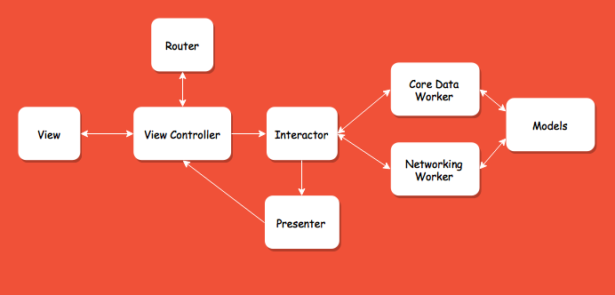
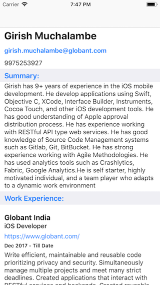
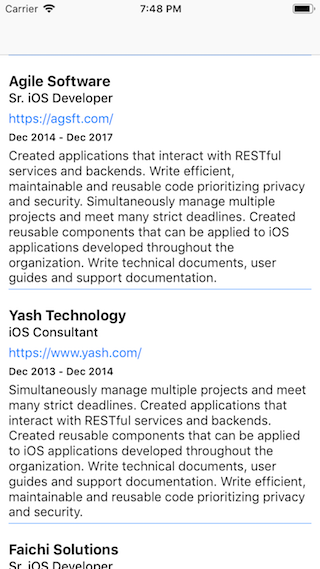
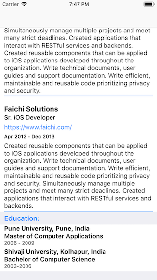

# My Profile
[](https://developer.apple.com/xcode/)
[](https://swift.org)
[](https://developer.apple.com/ios/)


A native iOS app written in Swift to demonstrate the user's professional summery

## Architecture Diagram


## Screenshots
<div align="left">
    
    
    
</div>

## Why Clean Swift Architecture (VIP)?
1. Simplicity
2. Unidirectional flow of data
3. Testability
4. Extensibility 


## License

```
MIT License

Copyright (c) 2019 Girish Muchalambe

Permission is hereby granted, free of charge, to any person obtaining a copy of 
this software and associated documentation files (the "Software"), to deal in the 
Software without restriction, including without limitation the rights to use, copy, 
modify, merge, publish, distribute, sublicense, and/or sell copies of the Software, 
and to permit persons to whom the Software is furnished to do so, subject to 
the following conditions:

The above copyright notice and this permission notice shall be included in 
all copies or substantial portions of the Software.

THE SOFTWARE IS PROVIDED "AS IS", WITHOUT WARRANTY OF ANY KIND, EXPRESS OR IMPLIED, 
INCLUDING BUT NOT LIMITED TO THE WARRANTIES OF MERCHANTABILITY, FITNESS FOR A PARTICULAR 
PURPOSE AND NONINFRINGEMENT. IN NO EVENT SHALL THE AUTHORS OR COPYRIGHT HOLDERS BE 
LIABLE FOR ANY CLAIM, DAMAGES OR OTHER LIABILITY, WHETHER IN AN ACTION OF CONTRACT, 
TORT OR OTHERWISE, ARISING FROM, OUT OF OR IN CONNECTION WITH THE SOFTWARE OR 
THE USE OR OTHER DEALINGS IN THE SOFTWARE.
